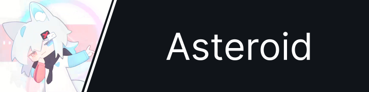

# ASTEROID

aka Asteroid, ΛSΤΞROΙD, AD, ~~欸低~~

building things I probably shouldn't, but do anyway.

━━━━━━━━━━━━━━━━━━━━━━━━━━

## about

I’ve touched a bit of everything.

Main focus now:
- Discord Bot development
- Next.js
- Arduino / ESP32 experiments

I like systems.
I like real-time things.
I like when software talks to hardware.

Theme preference: light blue / Material You style.

━━━━━━━━━━━━━━━━━━━━━━━━━━

## current project

### AturalBot

A Discord bot built as a long-term evolving system.
Not just commands — architecture, websocket, dashboard, control flow.

Status: actively building

━━━━━━━━━━━━━━━━━━━━━━━━━━

## previous projects

### [Info-Asteroid asteroid.tw](https://asteroid.tw)

My personal website.
A place to experiment with layout, interaction and structure.

---

### > <

A Discord bot.
Now archived, but it was one of the early large experiments.

Status: discontinued

━━━━━━━━━━━━━━━━━━━━━━━━━━

## tech

Discord API  
discord.py  
Node.js  
Next.js  
Prisma  
Arduino  
ESP32  
WebSocket  
TCP / low-level experiments  

I don't specialize in only one layer. \
I like understanding the full stack — from UI to firmware.

━━━━━━━━━━━━━━━━━━━━━━━━━━

## direction

Exploring:

- real-time systems
- audio streaming
- soft/hardware integration
- structured long-term projects

Still building.
